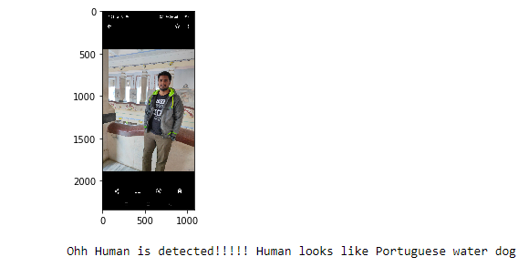

# dog-breed
Repository contains Dog breed multi-class classification project

1.Ddataset for dog images can be found at https://s3-us-west-1.amazonaws.com/udacity-aind/dog-project/dogImages.zip for this project
2.Dataset for human images can be found at https://s3-us-west-1.amazonaws.com/udacity-aind/dog-project/lfw.zip for this project

This is the repository for Dog Breed Classifier using CNN Project for Udacity Machine Learning Nanodegree Program.

Given an image of a dog, the algorithm will identify an estimate of the canine’s breed. If supplied an image of a human face, the code will identify the resembling dog breed.The final output predictions gives 1 out of the 133 values of dog's breed.

Software used:-
1. Anaconda
2. GPU(for faster processing)

Libraries Used:-
1. OpenCV (Open Computer Vision)
2. Haar Feature Cascade Classifier (to  to detect human faces in images)
3. VGG16 model (pre-trained model to detect dogs in images)
4. Resnet

Model after training looks gives predictions on dog's images like:-

Model can also be tested on cats images to see if it can give the desired results.

Model can also be tested on human images to see if our model can give the results of human images like dog breed.

Model gives accuracy of 16% on training on Custom CNN model:-

Model gives accuracy of 85% by using Transfer Learning of ResNet pre-trained.

Model gives prediction after training on resnet pretrained model

